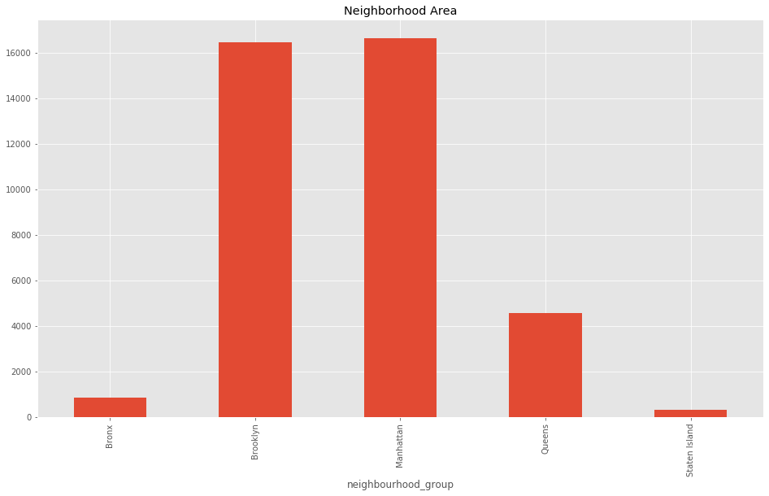
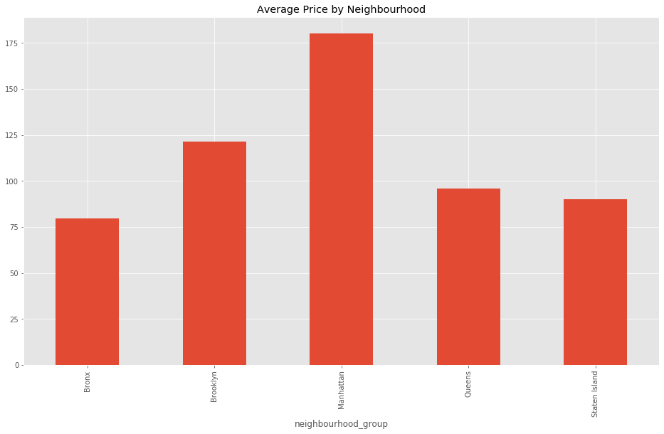
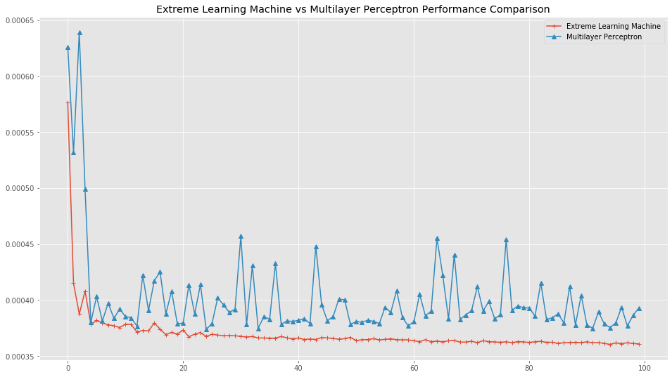

# Multilayer Perceptron vs Extreme Learning Machine
## An implementation and comparision

**import libraries**


```python
import pandas as pd
import numpy as np
from matplotlib import pyplot as plt
from sklearn.model_selection import train_test_split
from sklearn.preprocessing import LabelEncoder
from sklearn.neural_network import MLPRegressor
from sklearn.exceptions import ConvergenceWarning
from sklearn.utils.testing import ignore_warnings

plt.style.use("ggplot")
```

**Create MLP and ELM regressors**


```python
class MLP(MLPRegressor):
    @ignore_warnings(category=ConvergenceWarning)
    def __init__(self, sizes=(100,), act='relu', max_i=200):
        super().__init__(hidden_layer_sizes=sizes, activation=act, max_iter=max_i)
```


```python
class ELM(object):
    def __init__(self, hidden_units=200):
        self._hidden_units = hidden_units
        
    def train(self, X, Y):
        X = np.column_stack([X, np.ones([X.shape[0], 1])])
        self.random_weights = np.random.randn(X.shape[1], self._hidden_units)
        G = np.tanh(X.dot(self.random_weights))
        self.w_elm = np.linalg.pinv(G).dot(Y)
        
    def predict(self, X):
        X = np.column_stack([X, np.ones([X.shape[0], 1])])
        G = np.tanh(X.dot(self.random_weights))
        return G.dot(self.w_elm)
```


```python
path = './data/air_bnb_nyc.csv'
df = pd.read_csv(path, index_col='id')
df.head()
```


<div>
<style scoped>
    .dataframe tbody tr th:only-of-type {
        vertical-align: middle;
    }

    .dataframe tbody tr th {
        vertical-align: top;
    }

    .dataframe thead th {
        text-align: right;
    }
</style>
<table border="1" class="dataframe">
  <thead>
    <tr style="text-align: right;">
      <th></th>
      <th>name</th>
      <th>host_id</th>
      <th>host_name</th>
      <th>neighbourhood_group</th>
      <th>neighbourhood</th>
      <th>latitude</th>
      <th>longitude</th>
      <th>room_type</th>
      <th>price</th>
      <th>minimum_nights</th>
      <th>number_of_reviews</th>
      <th>last_review</th>
      <th>reviews_per_month</th>
      <th>calculated_host_listings_count</th>
      <th>availability_365</th>
    </tr>
    <tr>
      <th>id</th>
      <th></th>
      <th></th>
      <th></th>
      <th></th>
      <th></th>
      <th></th>
      <th></th>
      <th></th>
      <th></th>
      <th></th>
      <th></th>
      <th></th>
      <th></th>
      <th></th>
      <th></th>
    </tr>
  </thead>
  <tbody>
    <tr>
      <th>2539</th>
      <td>Clean &amp; quiet apt home by the park</td>
      <td>2787</td>
      <td>John</td>
      <td>Brooklyn</td>
      <td>Kensington</td>
      <td>40.64749</td>
      <td>-73.97237</td>
      <td>Private room</td>
      <td>149</td>
      <td>1</td>
      <td>9</td>
      <td>19.10.2018</td>
      <td>0.21</td>
      <td>6</td>
      <td>365</td>
    </tr>
    <tr>
      <th>2595</th>
      <td>Skylit Midtown Castle</td>
      <td>2845</td>
      <td>Jennifer</td>
      <td>Manhattan</td>
      <td>Midtown</td>
      <td>40.75362</td>
      <td>-73.98377</td>
      <td>Entire home/apt</td>
      <td>225</td>
      <td>1</td>
      <td>45</td>
      <td>21.05.2019</td>
      <td>0.38</td>
      <td>2</td>
      <td>355</td>
    </tr>
    <tr>
      <th>3647</th>
      <td>THE VILLAGE OF HARLEM....NEW YORK !</td>
      <td>4632</td>
      <td>Elisabeth</td>
      <td>Manhattan</td>
      <td>Harlem</td>
      <td>40.80902</td>
      <td>-73.94190</td>
      <td>Private room</td>
      <td>150</td>
      <td>3</td>
      <td>0</td>
      <td>NaN</td>
      <td>NaN</td>
      <td>1</td>
      <td>365</td>
    </tr>
    <tr>
      <th>3831</th>
      <td>Cozy Entire Floor of Brownstone</td>
      <td>4869</td>
      <td>LisaRoxanne</td>
      <td>Brooklyn</td>
      <td>Clinton Hill</td>
      <td>40.68514</td>
      <td>-73.95976</td>
      <td>Entire home/apt</td>
      <td>89</td>
      <td>1</td>
      <td>270</td>
      <td>05.07.2019</td>
      <td>4.64</td>
      <td>1</td>
      <td>194</td>
    </tr>
    <tr>
      <th>5022</th>
      <td>Entire Apt: Spacious Studio/Loft by central park</td>
      <td>7192</td>
      <td>Laura</td>
      <td>Manhattan</td>
      <td>East Harlem</td>
      <td>40.79851</td>
      <td>-73.94399</td>
      <td>Entire home/apt</td>
      <td>80</td>
      <td>10</td>
      <td>9</td>
      <td>19.11.2018</td>
      <td>0.10</td>
      <td>1</td>
      <td>0</td>
    </tr>
  </tbody>
</table>
</div>


```python
#dropping NaN
print(f'DF Shape before dropping NaN: {df.shape}')
df = df.dropna(axis=0)
print(f'DF\'s Shape after dropping NaN {df.shape}')
```

    DF Shape before dropping NaN: (48895, 15)
    DF's Shape after dropping NaN (38821, 15)
    

**Data Exploratory**


```python
neighbor = df.groupby('neighbourhood_group').size()
neighbor
```


    neighbourhood_group
    Bronx              875
    Brooklyn         16439
    Manhattan        16621
    Queens            4572
    Staten Island      314
    dtype: int64


```python
neighbor.plot(kind='bar', figsize=(16,9), title='Neighborhood Area')
plt.savefig('./data/neighbor.png')
```





```python
avg_price = df.groupby('neighbourhood_group').agg('mean').price
avg_price
```


    neighbourhood_group
    Bronx             79.558857
    Brooklyn         121.463289
    Manhattan        180.071596
    Queens            95.783683
    Staten Island     89.964968
    Name: price, dtype: float64


```python
avg_price.plot(kind='bar', figsize=(16,9), title='Average Price by Neighbourhood')
plt.savefig('./data/avg_price.png')
```





```python
#drop useless feature
df = df.drop(axis=1, labels=['name', 'host_id', 'host_name', 'neighbourhood', 'latitude', 'longitude', 'last_review'])
df.head()
```


<div>
<style scoped>
    .dataframe tbody tr th:only-of-type {
        vertical-align: middle;
    }

    .dataframe tbody tr th {
        vertical-align: top;
    }

    .dataframe thead th {
        text-align: right;
    }
</style>
<table border="1" class="dataframe">
  <thead>
    <tr style="text-align: right;">
      <th></th>
      <th>neighbourhood_group</th>
      <th>room_type</th>
      <th>price</th>
      <th>minimum_nights</th>
      <th>number_of_reviews</th>
      <th>reviews_per_month</th>
      <th>calculated_host_listings_count</th>
      <th>availability_365</th>
    </tr>
    <tr>
      <th>id</th>
      <th></th>
      <th></th>
      <th></th>
      <th></th>
      <th></th>
      <th></th>
      <th></th>
      <th></th>
    </tr>
  </thead>
  <tbody>
    <tr>
      <th>2539</th>
      <td>Brooklyn</td>
      <td>Private room</td>
      <td>149</td>
      <td>1</td>
      <td>9</td>
      <td>0.21</td>
      <td>6</td>
      <td>365</td>
    </tr>
    <tr>
      <th>2595</th>
      <td>Manhattan</td>
      <td>Entire home/apt</td>
      <td>225</td>
      <td>1</td>
      <td>45</td>
      <td>0.38</td>
      <td>2</td>
      <td>355</td>
    </tr>
    <tr>
      <th>3831</th>
      <td>Brooklyn</td>
      <td>Entire home/apt</td>
      <td>89</td>
      <td>1</td>
      <td>270</td>
      <td>4.64</td>
      <td>1</td>
      <td>194</td>
    </tr>
    <tr>
      <th>5022</th>
      <td>Manhattan</td>
      <td>Entire home/apt</td>
      <td>80</td>
      <td>10</td>
      <td>9</td>
      <td>0.10</td>
      <td>1</td>
      <td>0</td>
    </tr>
    <tr>
      <th>5099</th>
      <td>Manhattan</td>
      <td>Entire home/apt</td>
      <td>200</td>
      <td>3</td>
      <td>74</td>
      <td>0.59</td>
      <td>1</td>
      <td>129</td>
    </tr>
  </tbody>
</table>
</div>


**Encode Categorical Features**


```python
le = LabelEncoder()
df['neighbourhood_group'] = le.fit_transform(df['neighbourhood_group'])
df['room_type'] = le.fit_transform(df['room_type'])
```


```python
df.head()
```


<div>
<style scoped>
    .dataframe tbody tr th:only-of-type {
        vertical-align: middle;
    }

    .dataframe tbody tr th {
        vertical-align: top;
    }

    .dataframe thead th {
        text-align: right;
    }
</style>
<table border="1" class="dataframe">
  <thead>
    <tr style="text-align: right;">
      <th></th>
      <th>neighbourhood_group</th>
      <th>room_type</th>
      <th>price</th>
      <th>minimum_nights</th>
      <th>number_of_reviews</th>
      <th>reviews_per_month</th>
      <th>calculated_host_listings_count</th>
      <th>availability_365</th>
    </tr>
    <tr>
      <th>id</th>
      <th></th>
      <th></th>
      <th></th>
      <th></th>
      <th></th>
      <th></th>
      <th></th>
      <th></th>
    </tr>
  </thead>
  <tbody>
    <tr>
      <th>2539</th>
      <td>1</td>
      <td>1</td>
      <td>149</td>
      <td>1</td>
      <td>9</td>
      <td>0.21</td>
      <td>6</td>
      <td>365</td>
    </tr>
    <tr>
      <th>2595</th>
      <td>2</td>
      <td>0</td>
      <td>225</td>
      <td>1</td>
      <td>45</td>
      <td>0.38</td>
      <td>2</td>
      <td>355</td>
    </tr>
    <tr>
      <th>3831</th>
      <td>1</td>
      <td>0</td>
      <td>89</td>
      <td>1</td>
      <td>270</td>
      <td>4.64</td>
      <td>1</td>
      <td>194</td>
    </tr>
    <tr>
      <th>5022</th>
      <td>2</td>
      <td>0</td>
      <td>80</td>
      <td>10</td>
      <td>9</td>
      <td>0.10</td>
      <td>1</td>
      <td>0</td>
    </tr>
    <tr>
      <th>5099</th>
      <td>2</td>
      <td>0</td>
      <td>200</td>
      <td>3</td>
      <td>74</td>
      <td>0.59</td>
      <td>1</td>
      <td>129</td>
    </tr>
  </tbody>
</table>
</div>


**Feature Engineering**


```python
price_div = df.price.max()
min_nights_div = df.minimum_nights.max()
n_review_div = df.number_of_reviews.max()
review_pm_div = df.reviews_per_month.max()
calcu_div = df.calculated_host_listings_count.max()
availa_div = df.availability_365.max()
```

**Regularize and Normalize Data**


```python
df.price = df.price / price_div
df.minimum_nights = df.minimum_nights / min_nights_div
df.number_of_reviews = df.number_of_reviews / n_review_div
df.reviews_per_month = df.reviews_per_month / review_pm_div
df.calculated_host_listings_count = df.calculated_host_listings_count / calcu_div
df.availability_365 = df.availability_365 / availa_div
```

**Data Preparation**


```python
X = df.drop(axis=1, labels=['price'])
Y = df.price
X_train, X_test, y_train, y_test = train_test_split(X, Y, test_size=0.3, random_state=32)
```


```python
class Helper(object):
    def get_elm(self):
        return self.elm
    
    def get_mlp(self):
        return self.mlp
    
    @ignore_warnings(category=ConvergenceWarning)
    def train_both(self, X, Y, n=100):
        self.iterations = list(range(1, n+1))
        self.elm_mse = []
        self.mlp_mse = []
        for i in self.iterations:
            print(f'{i}.. ', end=' ')
            self.elm = ELM(i)
            self.elm.train(X, Y)
            self.elm_mse.append(np.mean((Y - self.elm.predict(X))**2))
            self.mlp = MLP(sizes=(50,), act='tanh', max_i=i)
            self.mlp.fit(X, Y)
            self.mlp_mse.append(np.mean((Y - self.mlp.predict(X))**2))
        return (self.elm_mse, self.mlp_mse)
```

**Training and Model Evaluation**


```python
misc = Helper()
elm_mse, mlp_mse = misc.train_both(X_train, y_train, 100)
```

    1..  2..  3..  4..  5..  6..  7..  8..  9..  10..  11..  12..  13..  14..  15..  16..  17..  18..  19..  20..  21..  22..  23..  24..  25..  26..  27..  28..  29..  30..  31..  32..  33..  34..  35..  36..  37..  38..  39..  40..  41..  42..  43..  44..  45..  46..  47..  48..  49..  50..  51..  52..  53..  54..  55..  56..  57..  58..  59..  60..  61..  62..  63..  64..  65..  66..  67..  68..  69..  70..  71..  72..  73..  74..  75..  76..  77..  78..  79..  80..  81..  82..  83..  84..  85..  86..  87..  88..  89..  90..  91..  92..  93..  94..  95..  96..  97..  98..  99..  100..  


```python
plt.figure(figsize=(16, 9))
plt.title("Extreme Learning Machine vs Multilayer Perceptron Performance Comparison")
plt.plot(elm_mse, '+-', label='Extreme Learning Machine')
plt.plot(mlp_mse, '^-', label='Multilayer Perceptron')
plt.legend()
#plt.yscale('log')
plt.savefig('./data/comparison_output.png')
plt.show()
```





**Testing and Evaluation**


```python
elm = misc.get_elm()
mlp = misc.get_mlp()
```


```python
print(f'ELM MSE: {np.mean((y_test-elm.predict(X_test))**2)}')
print(f'MLP MSE: {np.mean((y_test-mlp.predict(X_test))**2)}')
```

    ELM MSE: 0.00027593071294904217
    MLP MSE: 0.000303740504060233
    


```python

```
